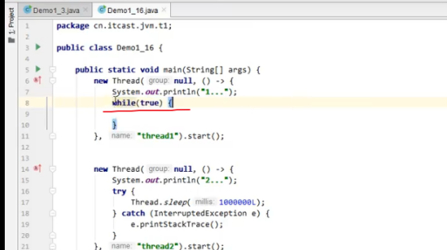
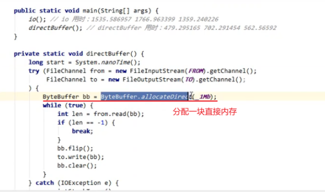

# 1. 运行时数据区

Java虚拟机在执行Java程序的过程中会把它所管理的内存划分为若干个不同的数据区域。 这些区域
有各自的用途， 以及创建和销毁的时间， 有的区域随着虚拟机进程的启动而一直存在， 有些区域则是
依赖用户线程的启动和结束而建立和销毁。  


### 1.1 程序计数器


#### 1.1.1 定义

当前线程所执行的字节码的`行号指示器`。  

字节码解释器工作时就是通过**改变这个计数器的值**来选取下一条需要执行的字节码指令， 它是程序控制流的指示器， 分支、 循环、 跳转、 异常处理、 线程恢复等基础功能都需要依赖这个计数器来完成。  

在任何一个确定的时刻， 一个处理器（对于多核处理器来说是一个内核） 都只会执行一条线程中的指令。为了线程切换后能恢复到正确的执行位置， **每条线程都需要有一个独立的程序计数器**， 各条线程之间计数器互不影响， 独立存储， 我们称这类内存区域为“线程私有”的内存 . 

- Java方法,计数器记录的是正在执行的虚拟机字节码指令的地址
- 本地（Native） 方法， 计数器值则应为空（Undefined）   

不会存在内存溢出

```java
0: getstatic #20 							// PrintStream out = System.out;
3: astore_1 								// --
4: aload_1 									// out.println(1);
5: iconst_1 								// --
6: invokevirtual #26 						// --
9: aload_1 									// out.println(2);
10: iconst_2 								// --
11: invokevirtual #26 						// --
14: aload_1 								// out.println(3);
15: iconst_3 								// --
16: invokevirtual #26 						// --
19: aload_1 								// out.println(4);
20: iconst_4 								// --
21: invokevirtual #26 						// --
24: aload_1 								// out.println(5);
25: iconst_5 								// --
26: invokevirtual #26 						// --
29: return
```


### 1.2 虚拟机栈


#### 1.2.1 定义

虚拟机栈描述的是**Java方法执行的线程内存模型**： 每个方法被执行的时候， Java虚拟机都会同步创建一个栈帧（Stack Frame） 用于**存储局部变量表、 操作数栈、 动态连接、 方法出口**等信息。 每一个方法被调用直至执行完毕的过程， 就对应着一个栈帧在虚拟机栈中从入栈到出栈的过程。

**局部变量表**存放了编译期可知的各种

- Java虚拟机基本数据类型（boolean、 byte、 char、 short、 int、float、 long、 double）

- 对象引用 reference类型， 它并不等同于对象本身.
  - 可能是一个指向对象起始地址的引用指针， 
  - 也可能是指向一个代表对象的句柄或者其他与此对象相关的位置

- returnAddress类型（指向了一条字节码指令的地址） 

数据类型在局部变量表中的存储空间以**局部变量槽（Slot）** 来表示， 其中64位长度的long和
double类型的数据会占用两个变量槽， 其余的数据类型只占用一个。 局部变量表所需的内存空间**在编**
**译期间完成分配**， 当进入一个方法时， **方法需要在栈帧中分配多大的局部变量空间是完全确定**
**的， 在方法运行期间不会改变局部变量表的大小**。  “大小”是指变量槽的数量，
虚拟机真正使用多大的内存空间（譬如按照1个变量槽占用32个比特、 64个比特， 或者更多） 来实现一
个变量槽， 这是完全由具体的虚拟机实现自行决定的事情。  


虚拟栈可能会报2个异常:

- 线程请求的栈深度大于虚拟机所允许的深度， 将抛出StackOverflowError异常； 

- 如果Java虚拟机栈容量可以动态扩展， 当栈扩展时无法申请到足够的内存会抛出OutOfMemoryError异常。  


虚拟机栈是线程私有的.  


#### 1.2.2 问题辨析

- 垃圾回收是否涉及栈内存？

GC不涉及栈内存，因为当前被调用的方法在调用结束后，会自动出栈。不需要垃圾回收。堆中的内存需要垃圾回收

- 栈内存分配越大越好吗？

可以进行更多次数的递归调用，不会提高运行效率，因为栈内存划分的越大，可分配的线程数就会减少

- 方法内的局部变量是否线程安全？


如果方法内局部变量没有逃离方法的作用访问，它是线程安全的

如果是局部变量引用了对象，并逃离方法的作用范围，需要考虑线程安全  


#### 1.2.3 栈内存溢出

- 栈帧过多导致栈内存溢出。


- 栈帧过大导致栈内存溢出


#### 1.2.4 线程运行诊断

##### (1)cpu占用过多

1.先定位进程: `top`

2.再定位具体的线程:` ps H -eo pid,tid,%cpu | grep 进程id`


3.jstack 占用高的线程号





##### (2)程序运行长时间没有结果


### 1.3 本地方法栈


本地方法栈也会在栈深度溢出或者栈扩展失败时分别抛出StackOverflowError和OutOfMemoryError异常。  


### 1.4 堆


#### 1.4.1 概念

Java堆是**被所有线程共享**的一块内存区域， 在虚拟机**启动时创建**。   

Java世界里“几乎”所有的对象实例都在这里分配内存 .通过 new 关键字，创建对象都会使用堆内存  

Java堆是垃圾收集器管理的内存区域 ,也叫GC堆.

现代垃圾收集器大部分都是基于分代收集理论设计的， Java堆中经常会出现

- 新生代

- 老年代

- 永久代

- Eden空间 (伊甸园区)

- From Survivor空间

- To Survivor空间

等名词 .

从分配内存的角度看， 所有线程共享的Java堆中可以划分出多个**线程私有的分配缓冲区**（Thread Local Allocation Buffer， **TLAB**）   

Java堆可以处于物理上不连续的内存空间中， 但在逻辑上它应该被视为连续的  .

Java堆既可以被实现成固定大小的， 也可以是可扩展的， 不过当前主流的Java虚拟机都是按照可扩展来实现的（通过参数-Xmx和-Xms设定） 。

如果在Java堆中没有内存完成实例分配， 并且堆也无法再扩展时， Java虚拟机将会抛出OutOfMemoryError异常。 


#### 1.4.2 堆内存溢出


#### 1.4.3 堆内存诊断

- jps工具

查看当前系统中有哪些Java进程。

- jmap工具

查看堆内存占用情况，jmap -hean 进程编号


- jconsole工具

图形界面，多功能监测工具，可以连续监测


#### 1.4.4 案例

(1)垃圾回收后，堆内存占用仍然很高？

jvisualvm可视化工具


### 1.5 方法区

#### 1.5.1 概念


方法区用于存储已被虚拟机加载的类型信息、 常量、 静态变量、 即时编译器编译后的代码缓存等数据  .

线程共享.


- JDK 6的时候HotSpot开发团队就有放弃永久代， 逐步改为采用本地内存（Native Memory） 来实现方法区的计划了.

- JDK 7的HotSpot， 已经把原本放在永久代的`字符串常量池`、 `静态变量`等移出，
- JDK 8，完全废弃了永久代， 改用与JRockit、 J9一样在本地内存中实现的`元空间（Metaspace）` 来代替， 把JDK 7中永久代还剩余的内容（主要是类型信息） 全部移到元空间中。  

方法区的内存回收目标主要是针对**常量池的回收和对类型的卸载**.

方法区无法满足新的内存分配需求时， 将抛出OutOfMemoryError异常.


### 1.6 运行时常量池

#### 1.6.1 概念


运行时常量池（Runtime Constant Pool） 是方法区的一部分。 

Class文件中除了有类的版本、 字段、 方法、 接口等描述信息外， 还有一项信息是`常量池表（Constant Pool Table） `， 用于存放编译期生成的各种字面量与符号引用， 这部分内容将在类加载后存放到方法区的运行时常量池中。  

运行时常量池保存2类:

- 保存Class文件中描述的符号引用

- 由符号引用翻译出来的直接引用

并非`预置入Class文件中常量池的内容`才能进入方法区运行时常量池， 运行期间也可以将新的常量放入池中， String类的intern()方法。  

当常量池无法再申请到内存时会抛出OutOfMemoryError异常.


常量池：是一张表，虚拟机指令根据这张常量表找到要执行的类名、方法名、参数类型、字面量等信息。

运行时常量池：常量池是*.class文件中的，当该类被加载时，它的常量池信息就会放入到运行时常量池中，并把里面的符号地址变为真实地址。


#### 1.6.2 String Table问题


String s4 = s1+s2的分析：


String s5 = “a”+”b”的分析：


字符串延时加载


#### 1.6.3 String Table特性

常量池中的字符仅仅是符号，第一次用到时才变成对象。

利用串池的机制来避免重复创建字符串对象。

字符串变量拼接的原理是new StringBuilder().append(a).append(b).toString()。

字符串常量拼接原理是编译器优化。

可以使用intern()方法，主动将串池中还没有的字符串对象放入串池。


jdk1.8将这个字符串对象尝试放入串池，如果有则不会放入；如果没有则放入串池，并会把串池中的对象返回。

jdk1.6将这个字符串对象尝试放入串池，如果有则不会放入；如果没有则会把对象复制一份放入串池，会把串池中的对象返回。


#### 1.6.4 String Table垃圾回收


#### 1.6.5 String Table性能调优


桶的个数较多时，运行速度块，


桶的个数较小时，运行速度慢，


桶的大小范围


向串池中放字符串的原理是哈希表，桶越大（哈希表越大）产生冲突的次数就越少，因此运行效率高。

调整命令  -XX:StringTableSize=桶个数

考虑将字符串对象是否入池。


#### 1.6.6 入池与不入池的对比


未读取前，1M占用


读取后，300M占用


修改代码，将字符串加入串池，


入池后，30M内存占用（是放入堆的1/10）


### 1.7 直接内存

#### 1.7.1 概念

直接内存（Direct Memory） 并不是虚拟机运行时数据区的一部分， 也不是《Java虚拟机规范》 中
定义的内存区域 .

在JDK 1.4中新加入了`NIO（New Input/Output） 类`， 引入了一种`基于通道（Channel） 与缓冲区（Buffer） `的I/O方式， 它可以使用Native函数库直接分配堆外内存， 然后通过一个存储在Java堆里面的DirectByteBuffer对象作为这块内存的引用进行操作。 这样能在一些场景中显著提高性能， 因为避免了在Java堆和Native堆中来回复制数据。

  




机直接内存的分配不会受到Java堆大小的限制 

- 常见于 NIO 操作时，用于数据缓冲区
- 分配回收成本较高，但读写性能高
- 不受 JVM 内存回收管理  


#### 1.7.2 分配和回收原理

- 使用了 Unsafe 对象完成直接内存的分配回收，并且回收需要主动调用 freeMemory 方法

- ByteBuffer 的实现类内部，使用了 Cleaner （虚引用）来监测 ByteBuffer 对象，一旦
  ByteBuffer 对象被垃圾回收，那么就会由 ReferenceHandler 线程通过 Cleaner 的 clean 方法调
  用 freeMemory 来释放直接内存  


#### 1.7.3 ByteBuffer源码分析


Cleaner是一个`虚引用类型`，当它关联的对象被回收时，自动调用。


解决方法：

使用unsafe.freeMemory()来管理直接内存；


### 1.8 HotSpot虚拟机对象分析

#### 1.8.1 创建对象

